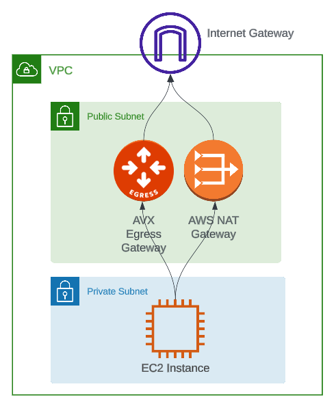

# AWS NAT to Aviatrix Secure Egress Demo

## Description

This terraform repository serves as the infrastructure as code (IaC) for a demonstration on how to migrate from an `AWS NAT Gateway` to an `Aviatrix Secure Egress Gateway` without incurring network downtime.

## Diagram

## Steps

1. The first terraform apply deploys:

   - A vpc with 1 public and 1 private subnet.
   - An AWS NAT gateway.
   - An Aviatrix Egress gateway.
   - A test instance in the private subnet that is generating traffic to the Internet via the NAT gateway.

2. After setting the local variable `avx_egress` from `false` to `true`, the second terraform apply:

   - Instructs the Aviatrix controller to set the `0.0.0.0/0` route on the private subnet from the `AWS NAT` to the `Aviatrix Gateway`.
   - Enables `Egress FQDN Discovery` on the Aviatrix Gateway so that Internet-bound traffic is now visible.

3. After removing the `0.0.0.0/0` route definition from terraform state and setting the local variable `aws_nat` from `true` to `false`, the third terraform apply:

   - Removes the aws nat gateway and its eip.

4. After disabling fqdn discovery, commenting the code in `egress_discovery.tf`, and uncommenting the code in `egress_fqdn.tf`, the fourth terraform apply:

   - Create an fqdn tag with a set of rules to block all Internet traffic, except that which is explicitly allowed.

## Demo

A video of this demo can be seen on [youtube](https://www.youtube.com/watch?v=oufrD58B_hc)

## Conclusion

In just the above few steps a VPC's Internet traffic can be discovered and secured using an Aviatrix Secure Egress Gateway without any network downtime.
