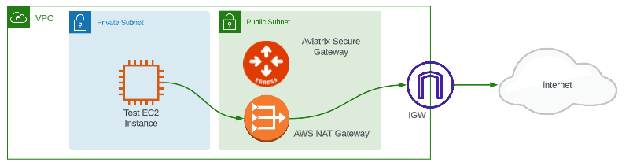
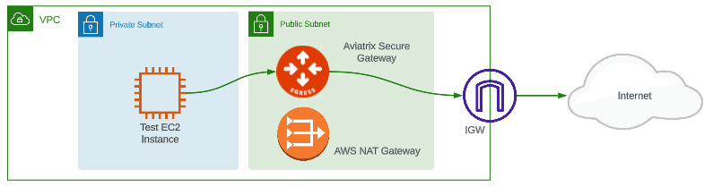

# AWS NAT to Aviatrix Secure Egress Demo

## Description

This terraform repository serves as the infrastructure as code (IaC) for a demonstration on how to migrate from an `AWS NAT Gateway` to an `Aviatrix Secure Egress Gateway` without incurring network downtime.

## Diagram

Initial topology:

## Prerequisites

A deployed and configured Aviatrix Controller (v7.1+) and CoPilot

### Compatibility

| Terraform version | Controller version | Aviatrix terraform provider version |
| :---------------- | :----------------- | :---------------------------------- |
| >= 1.2.0          | >= 7.1             | ~>3.1.0                             |

## Steps

1. The first terraform apply deploys:

   - A vpc with 1 public and 1 private subnet.
   - An AWS NAT gateway.
   - An Aviatrix Egress gateway.
   - A test instance in the private subnet that is generating traffic to the Internet via the NAT gateway.

2. After setting the local variable `avx_egress` from `false` to `true`, the second terraform apply:

   - Instructs the Aviatrix controller to set the `0.0.0.0/0` route on the private subnet from the `AWS NAT` to the `Aviatrix Gateway`.
   - Using CoPilot you now have visibility into the Internet-bound traffic flows traversing the Aviatrix egress gateway. Navigate to Security-->Distributed Firewalling-->Policy Monitor to view the logs.
   - The same as with AWS NAT gateway, all access to the Internet is being allowed. 

3. After setting the local variable `aws_nat` from `true` to `false`, the third terraform apply:

   - Removes the aws nat gateway and its eip.

4. After updating the local variable `avx_dfw_enforce`, from `false` to `true` the fourth terraform apply:

   - Creates a set of rules to block all Internet traffic, except that which is explicitly allowed.
   - Using CoPilot you now have visibility into the Internet-bound traffic flows being Permitted or Denied access to the Internet. Navigate to Security-->Distributed Firewalling-->Rules to review the rules applied.

## Demo

A video of this demo can be seen on [youtube](https://www.youtube.com/watch?v=oufrD58B_hc)

** Note: This demo was performed with egress v1.0 while this code implements egress v2.0 as part of the distributed firewalling feature in CoPilot.

## Conclusion

In just the above few steps a VPC's Internet traffic can be discovered and secured using an Aviatrix Secure Egress Gateway without any network downtime.
